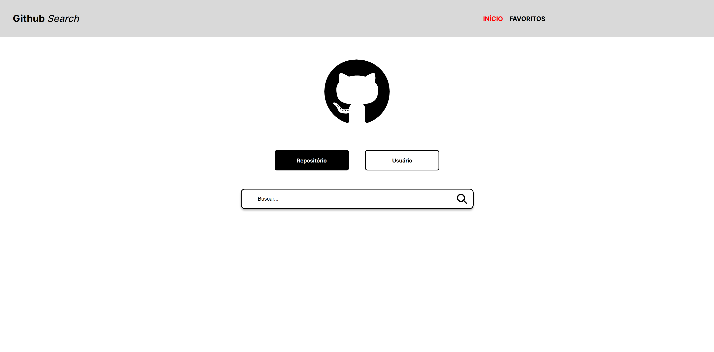
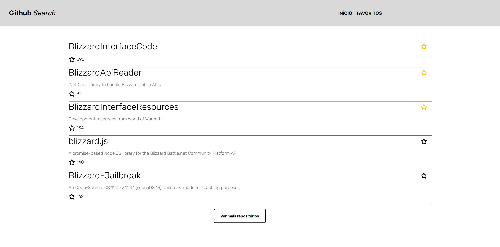
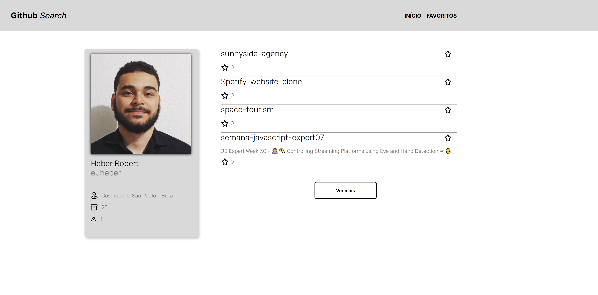
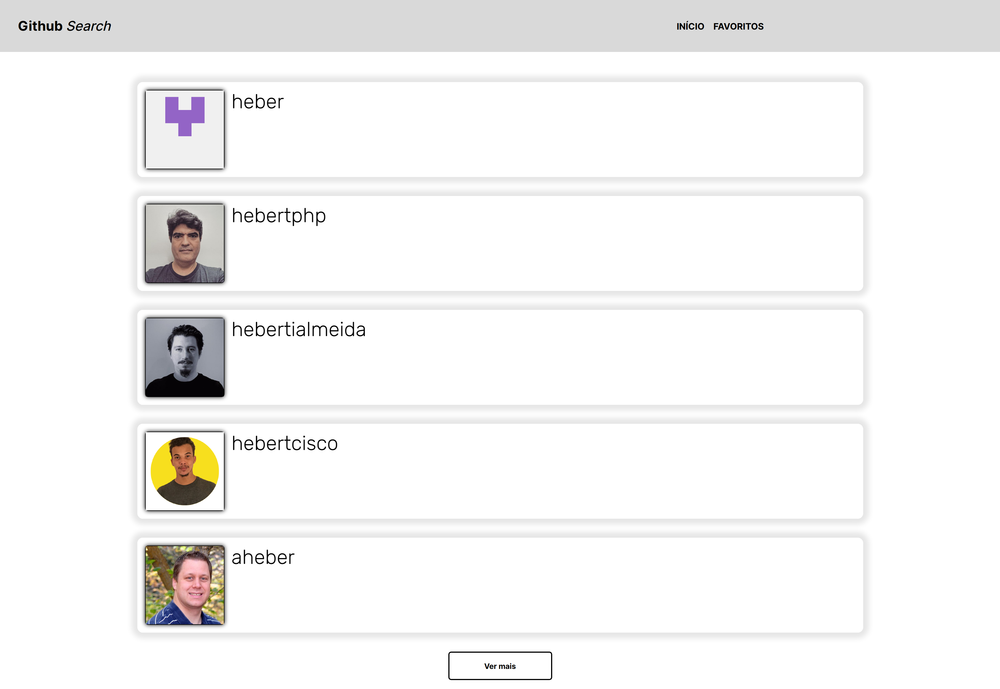
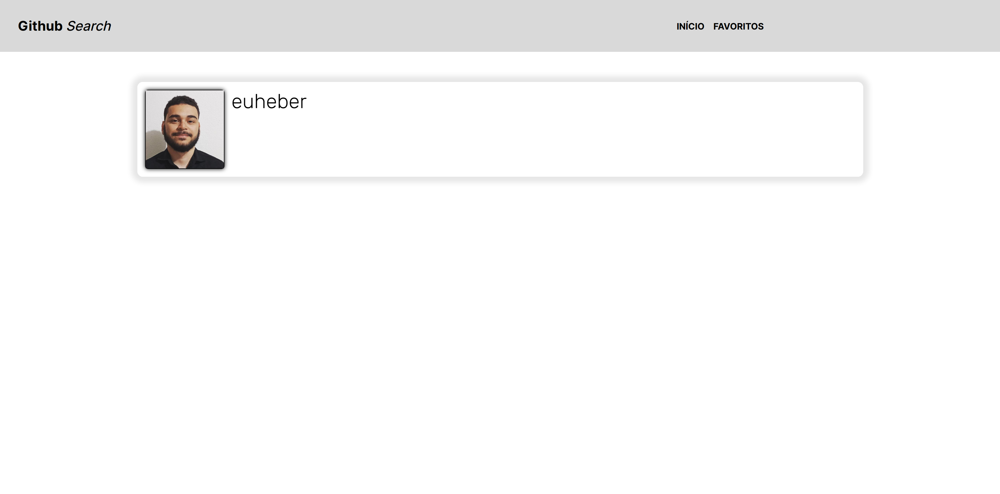
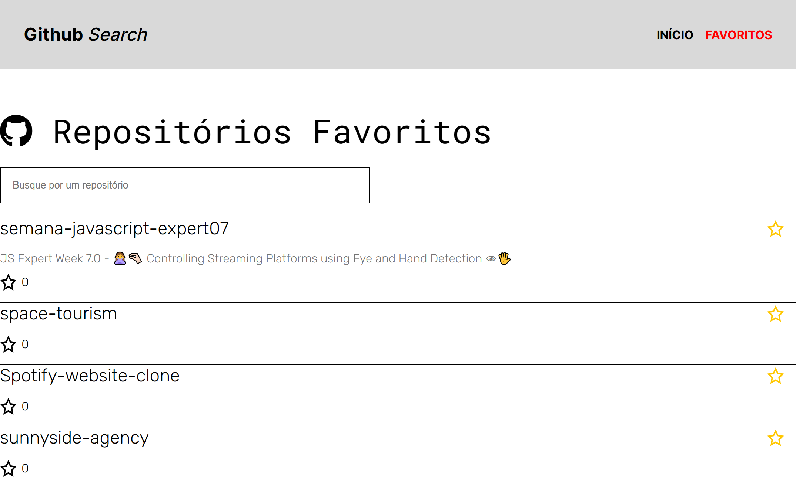

  

## 💻 Projeto

Esse projeto é um teste técnico para empresa Lux One para vaga de desenvolvedor Front End Junior. Nele é possível acessar repositórios e usuários do Github por meio de requisições da API da plataforma.

## 🚀 Tecnologias

- [HTML](https://developer.mozilla.org/pt-BR/docs/Web/HTML)
- [SASS](https://sass-lang.com/)
- [Vue JS](https://vuejs.org/)
- [Pinia](https://pinia.vuejs.org/)

## 📝 Requisitos do desafio

- [ ]  Eu, como usuário, desejo buscar por um usuário do GitHub, me será mostrado uma lista com o(s) usuário(s) com o nome que eu digitei, onde será mostrado o nome de usuário (login). Quando eu clicar no nome do usuário desejo ir para a tela que mostrará os detalhes sobre o usuário;

- [ ]  Eu, como usuário, desejo visualizar os detalhes desse(s) usuário(s) que foi buscado (organização, localização, número de seguidores e repositórios), onde os repositórios tem que ser ordenado em ordem DECRESCENTE;

- [ ]  Eu, como usuário, desejo visualizar os detalhes desse(s) usuário(s) que foi buscado (organização, localização, número de seguidores e repositórios), onde os repositórios tem que ser ordenado em ordem DECRESCENTE;

- [ ]  Eu, como usuário, desejo visualizar os detalhes desse(s) usuário(s) que foi buscado (organização, localização, número de seguidores e repositórios), onde os repositórios tem que ser ordenado em ordem DECRESCENTE;

- [ ]  Eu, como usuário, desejo visualizar uma tela de erro caso eu vá para alguma tela que não exista no projeto.

- [ ]  Eu, como usuário, desejo visualizar uma tela de erro caso eu vá para alguma tela que não exista no projeto.

## 📝 Implementações adicionais

- [ ] Repositórios que estejam marcados como favoritos ficaram marcados como favoritos em futuras buscas também. Dessa maneira o usuário saberá que aquele repositório já foi favoritado antes. O mesmo vale para os repositórios mostrados dentro da página de perfil de um usuário. Veja no exemplo abaixo

Abaixo, feita uma nova busca pelo mesmos repositórios.

- [ ] Foi acrecentado a renderização condicional de algumas informações do usuário. Uma vez que algumas informações não são preenchidas.  Na imagem abaixo, o icone de empresa onde trabalha não foi renderizado.

- [ ] O botão para ver mais usuários só aparece quando existem mais usuários para ver. O mesmo vale para repositórios

- [ ] Foi implementado  um filtro dentro do favoritos, facilitando a procura por reposótorios. 

## 📝 Possíveis melhorias

 - [ ]   Uma possível melhoria para esse projeto, seria salvar os repositórios favoritados dentro da localStorage do navegador. Dessa maneira as informações não se perderiam ao atualizar a página.

